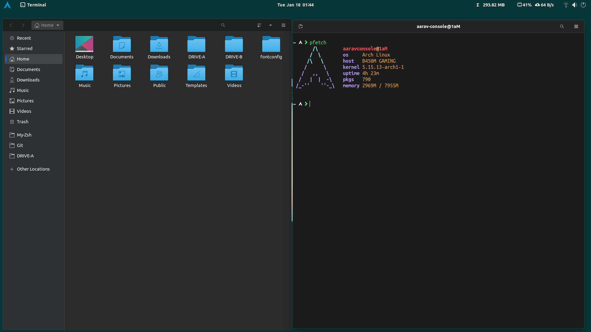

<p align="center">
  
</p>

<hr>

<h3 align="center">Includes configured theme, icons, .zshrc and starship.toml</h3>


## Acknowledgements

 - [Papirus icon theme](https://github.com/PapirusDevelopmentTeam/papirus-icon-theme)
 - [Oh my zsh](https://ohmyz.sh/)
 - [Starship](https://starship.rs/)
 - [Gnomelook.org](https://www.gnome-look.org/browse/)
 - [Gnome shell extensions](https://extensions.gnome.org/)


## Installation

Install My-Setup with Git

```bash
  git clone https://github.com/Aarav619/My-GDE.git
  cd My-GDE
```
    
## Usage
`make backup`: To backup current configs or settings.

`make restore`: To restore only configs or settings.

`make install-packages`: To install packages.

`make complete-install`: To restore complete packages along with configs & settings.


## Screenshots





## Suggestions

Suggestions are always welcome. :grinning: